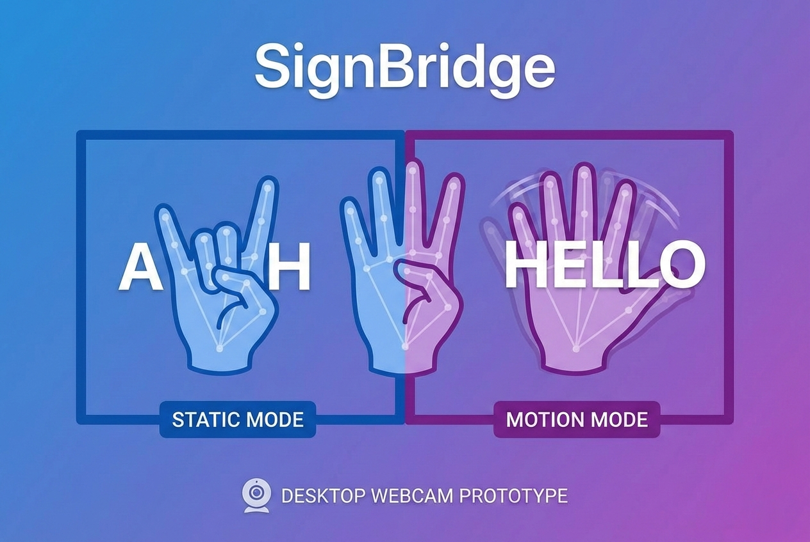
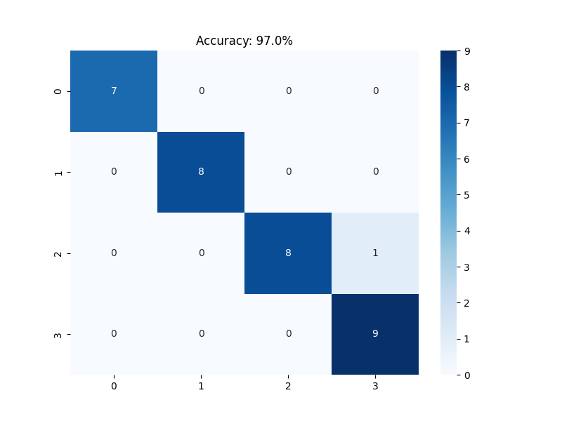
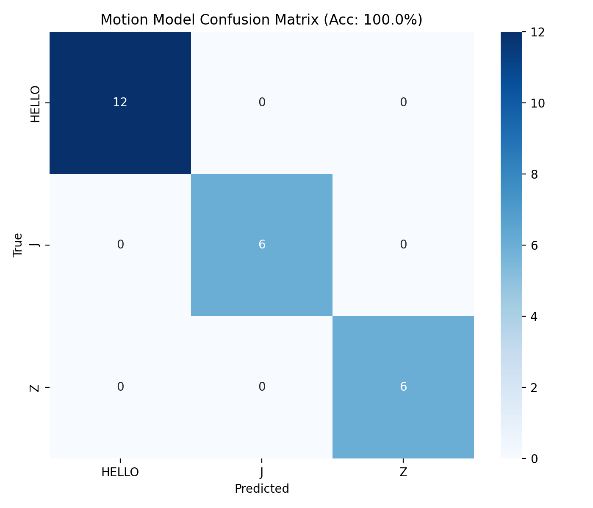

# SignBridge

**Dual-mode sign language classifier for classroom accessibility.** Combines static hand pose recognition (A, H, GOOD, BAD) with motion gesture recognition (HELLO, J, Z) using MediaPipe landmarks and RandomForest models. Desktop webcam prototype optimized for low-end hardware.

## Problem

Communication barriers in classrooms for deaf/hard-of-hearing students. Current solutions require expensive hardware or complex mobile apps. SignBridge demonstrates a practical, low-cost approach using standard webcams and laptops.

## Solution Overview

SignBridge processes webcam video in real-time:

1. **MediaPipe HandLandmarker** extracts 21 hand landmarks (x, y, z coordinates)
2. **Static model** classifies single-frame poses (A, H, GOOD, BAD)
3. **Motion model** classifies 16-frame gesture sequences (HELLO, J, Z)
4. **Gating logic** selects the appropriate prediction based on wrist movement and confidence

The system prioritizes accuracy over speed, abstaining from predictions below confidence thresholds.

## System Architecture
```
Webcam (640x480) → MediaPipe HandLandmarker → 63 Features
                        ↓
              Static Model (63→4 classes)   Motion Model (1008→3 classes)
                        ↓
             Confidence Gating → Live Display (12 FPS optimized)
```
**Key design choice**: Motion detection only triggers when wrist displacement exceeds threshold (0.15 pixels), reducing false positives.

## Technical Implementation

### Models
| Model | Input | Output | Training Data |
|-------|-------|--------|---------------|
| Static | 63 features (1 frame) | A, H, GOOD, BAD | 100+ samples/class |
| Motion | 1008 features (16 frames) | HELLO, J, Z | 20+ sequences/class |

### Optimizations
- Frame skipping (MediaPipe every 2nd frame)
- MJPG webcam capture
- Reduced resolution (640x480)
- Monotonic timestamps for VIDEO mode stability

### Performance
- ~125 FPS (no hand), ~75 FPS (hand detected), ~3-4 FPS (when models are loaded)
- Windows laptop + integrated webcam
- Single signer dataset (controlled lighting)

## Limitations

- Vocabulary limited to 7 signs (4 static + 3 motion)
- Desktop prototype only (no mobile/embedded)
- Single signer dataset (needs multi-signer expansion)
- Classroom lighting required for reliable detection
- No real-time translation (classification only)

## Model Evaluation Results

### Static Model:



### Motion Model:


## What's Built vs Future Work

**Built**: Complete end-to-end prototype (collect → train → infer)   
**Future**: Android app, expanded vocabulary, multi-signer training

## Repository Structure
```
SignBridge/
├── dataset/
│   ├── static/training/     # Static training CSVs
│   ├── static/testing/      # Static testing CSVs
│   ├── motion/training/     # Motion training CSVs
│   └── motion/testing/      # Motion testing CSVs
├── models/
│   ├── model_trainer.py            # Static model training
│   ├── motion_trainer.py           # Motion model training
│   ├── model_tester.py             # Static model testing
│   ├── signbridge_model.pkl        # Static model
│   └── signbridge_motion_model.pkl # Motion model
├── results/                 # Confusion matrices + accuracy plots
├── signbridge.py            # Main live demo
├── requirements.txt         # Python 3.12 deps
└── hand_landmarker.task     # MediaPipe model
```
**Why this structure?**   
The repository is structured to clearly separate data collection, model training, and live inference.

## Quick Start

### Prerequisites
- Python 3.12
- Webcam
- Windows

### Setup
```bash
pip install -r requirements.txt
```
### How to run
```bash
python signbridge.py
```

**Controls**: `Q` to quit  
**Gestures**: Hold static poses or perform motion gestures (HELLO wave, J flick, Z zigzag)

## Development Decisions

- **RandomForest over deep learning**: No GPU required, trains instantly on laptops
- **16-frame motion window**: Balances gesture capture vs responsiveness
- **Confidence gating**: Prioritizes accuracy over false positives
- **Frame skipping**: Maintains usable FPS on low-end hardware

## Competition Entry

**Creator Colosseum: Student Founders. Real Startups**  
**Team**: Solo student developer  
**Timeline**: Initial MVP developed over one focused week, with iterative testing and refinement  
**Focus**: Realistic MVP demonstrating technical feasibility for accessibility

---

*Built with discipline, not hype.*
---